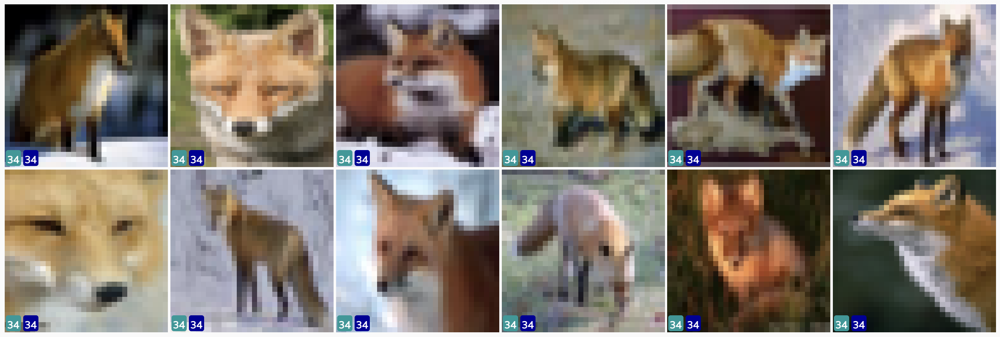
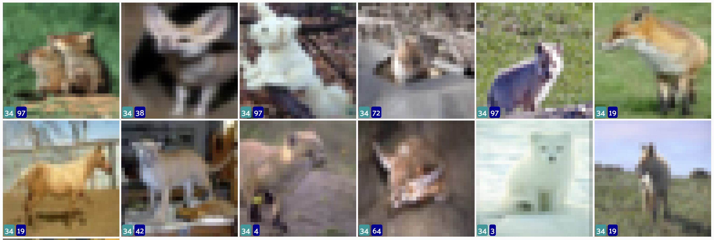

# Computer Vision Mini-project
# Efficient Fine-tuning of Visual Transformer

HuggingFace
https://huggingface.co/ansu0122/vit-lora/tree/main

WandB
https://wandb.ai/andriy-suh-private/lora-project

Fine-tuned CLIP Vit-Base/16 with LoRA.

## Repository Folder Structure

- **lora_clip/**: the module with LoRA implementation for CLIP ViT models.
- **encoder_utils.py**: the utilities for training and inference of the CLIP ViT encoder.
- **viz_utils.py**: the utilities to visualize the dataset with labels and predictions.
- **gym.py**: the implementation of the training loop with validation, metric logging to WAndB and a checkpoint persistence in HuggingFace.
- **lora_experiments.ipynb**: Training and inference experiments conducted.
- **install.sh**: the script to set up the project environment.

## Visualized with FiftyOne
SSH port forward to a local machine <br>
```ssh -L 5151:localhost:5151 <username>@<your-remote-ip>``` <br>
```http://localhost:5151```

### Misclassified examples

For instance, class 34 seems to be "Fox"


However, the most of the misclassified exmaples are outliers or labeled incorrectly


